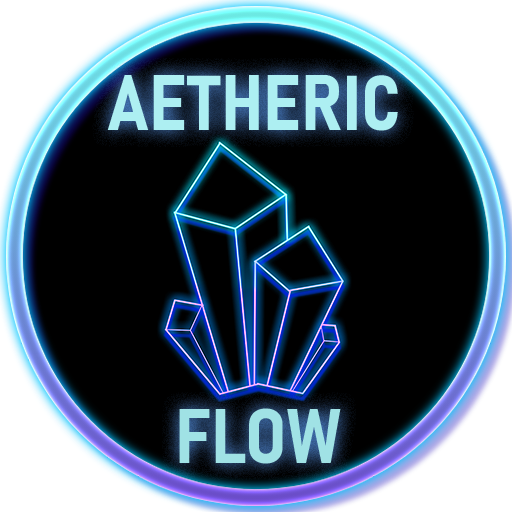
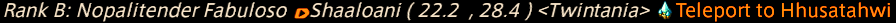
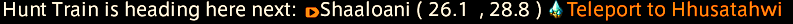

<div align="center"></div>

# Aetheric Flow

Teleport to any map link in chat with one click.

`Aetheric Flow` is a Dalamud plugin that watches your chat for map links, works out the nearest
aetheryte in that zone, and adds a clickable teleport link right after the coordinates.

## What It Does

- **Adds a teleport link** to every chat message containing a map link, labelled `Teleport to <aetheryte>`.
- **Picks the nearest crystal** by measuring the distance from the map link's coordinates to every aetheryte in that zone.
- **Only offers aetherytes you have attuned to**, so a link never fails when you click it.
- **Stays out of the way** when a zone has no aetheryte you can reach, leaving the message exactly as it was.
- **Teleports instantly** on click with no other plugin required.
- **Works without a mouse** thanks to `/aftp`, which teleports to the most recent map link so controller players can bind it to a macro.
- **Drops a map flag** on the destination as you teleport, so it is on your map, minimap and compass the moment you land.
- **Tells you when walking is quicker**, adding a quiet grey `Quicker on foot` note when you already stand closer to the link than the aetheryte does.
- **Takes the colour you want**, picked from the game's own chat palette in the settings window.
- **Scans only the channels you choose**, from party and say through to linkshells and tells.

## In Action

Hunt calls, hunt trains, treasure maps, anything with a map link in it gets a teleport link added to
the end of the message.





## Commands

- `/aethericflow` - Open the configuration window.
- `/aftp` - Teleport to the aetheryte from the most recent map link in chat, exactly as if you had clicked its link.
- `/aethericflowtp` - Alias for `/aftp`.

## For controller players

`/aftp` does the same thing as clicking a teleport link, so you never need to reach for the mouse.
Drop it into a macro and put that macro on your hotbar:

```
/aftp
```

The plugin remembers the most recent map link it added a teleport link to, on any channel you have
enabled. It keeps that target until a newer map link comes in, so there is no rush to press the
macro. The target is cleared when you log out.

## How to Install Aetheric Flow
Type `/xlplugins`, search for "Aetheric Flow", and click **Install**.

## Need help?

Join the [OOF Games Discord](https://discord.gg/vM6ff4h5Ym) and we'll get you sorted!
